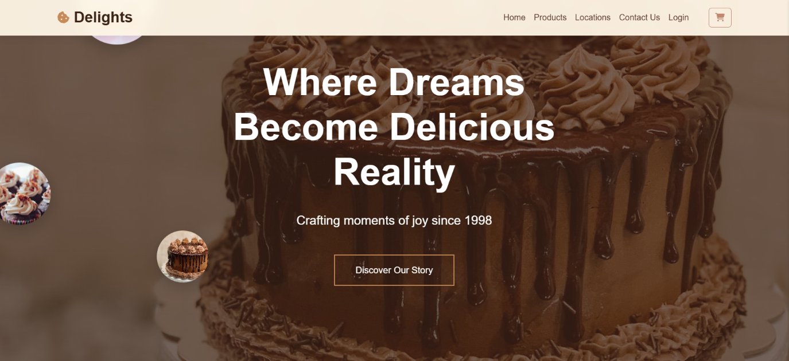

# CAKE SHOP
Welcome to the Cake Shop, my first web development project! This simple web application was built as a group project during my **third semester**, demonstrating fundamental front-end development skills.
The Cake Shop is developed using **HTML, CSS, Bootstrap, and JavaScript,** with **Google Fonts** integrated for enhanced styling.



## Features
1) **Navigation Bar**: It is the top most part of the web app. It has links to different pages of the web app.

2) **Home Page**: This is the first page that you will see when you open the Cake Shop. It consist of different sections like philosophy, showcase, Experience etc.

3) **Products**: This page consist of different types of cakes. Each cake has its own details like name, price, description etc. which can be viewed through flipping effect when hover.

4) **location**: In this page you can see two branches of store with address listed for better appearence and idea we placed **google map**.

5) **Contact Us**: Here you can fill the form to get in touch with us. I will implement and extend this feature in future as soon i learn backend conncetivity.

6) **Login**: You can also login to the Cake Shop using your email and password. if not you can create one by clicking on **create account** button. The most importantly this feature is developed using **local storage** concept of JavaScript. So you don't need to worry about your data as it will be stored in your browser. But remember this is not a secure way to store data. I will implement and extend this feature in future as soon i learn backend conncetivity.

7) **Cart**: The product which you added are display here with total amount to be paid. You also remove the product from cart if you want and adjust number of units for each.

## Installations
Clone the repo:
 ```sh
 git clone https://github.com/jainamb12/cake-shop.git
 ```

## Contributing
Contributions are welcome! Follow these steps:
1. Fork the project.
2. Create a new branch (`git checkout -b feature-branch`).
3. Commit your changes (`git commit -m 'Add feature'`).
4. Push to the branch (`git push origin feature-branch`).
5. Open a pull request.
